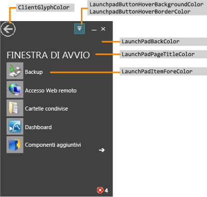
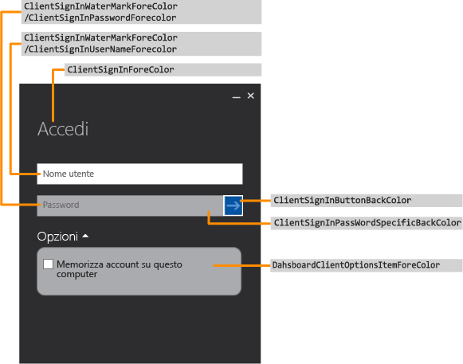
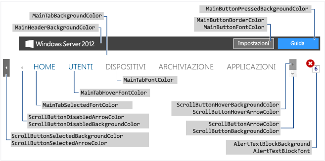
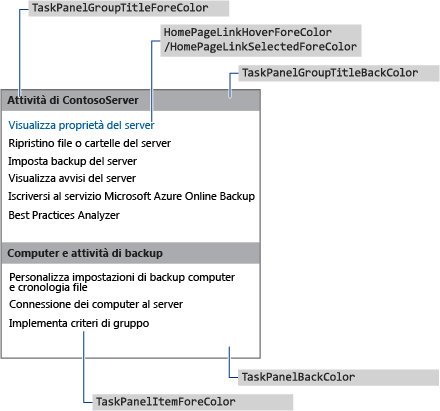
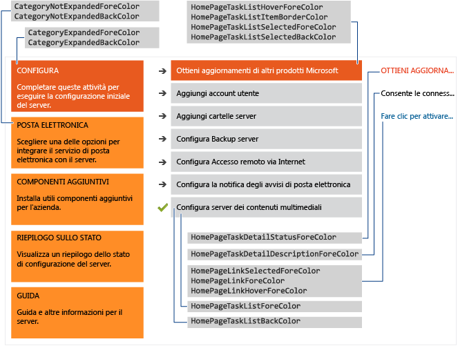

# <a name="change-the-color-scheme-of-the-dashboard-and-launchpad"></a>Modifica della combinazione di colori del dashboard e della finestra di avvio

>Si applica a: Windows Server 2016 Essentials, Windows Server 2012 R2 Essentials, Windows Server 2012 Essentials

È possibile modificare la combinazione di colori del dashboard e della finestra di avvio specificando i colori desiderati in un file XML, installando il file .xml in una cartella del server, quindi specificando il nome del file .xml in una voce del Registro di sistema.  
  
## <a name="create-the-xml-file"></a>Creazione del file xml  
 Nell'esempio seguente è indicato il contenuto possibile del file .xml:  
  
```xml  
<DashboardTheme xmlns="https://www.microsoft.com/HSBS/Dashboard/Branding/2010">  
  
  <!-- Hex color values overwriting default SKU theme colors -->  
  
    <SplashScreenBackgroundColor HexValue="FFFFFFFF"/>  
    <SplashScreenBorderColor HexValue="FF000000"/>  
    <MainHeaderBackgroundColor HexValue="FF414141"/>  
    <MainTabBackgroundColor HexValue="FFFFFFFF"/>  
    <MainTabFontColor HexValue="FF999999"/>  
    <MainTabHoverFontColor HexValue="FF0072BC"/>  
    <MainTabSelectedFontColor HexValue="FF0072BC"/>  
    <MainButtonPressedBackgroundColor HexValue="FF0072BC"/>  
    <MainButtonFontColor HexValue="FFFFFFFF"/>  
    <MainButtonBorderColor HexValue="FF6E6E6E"/>  
    <ScrollButtonBackgroundColor HexValue="FFF0F0F0"/>  
    <ScrollButtonArrowColor HexValue="FF999999"/>  
    <ScrollButtonHoverBackgroundColor HexValue="FF999999"/>  
    <ScrollButtonHoverArrowColor HexValue="FF6E6E6E"/>  
    <ScrollButtonSelectedBackgroundColor HexValue="FF6E6E6E"/>  
    <ScrollButtonSelectedArrowColor HexValue="FFFFFFFF"/>  
    <ScrollButtonDisabledBackgroundColor HexValue="FFF8F8F8"/>  
    <ScrollButtonDisabledArrowColor HexValue="FFCCCCCC"/>  
    <AlertTextBlockBackground HexValue="FFFFFFFF"/>  
    <AlertTextBlockFont HexValue="FF000000"/>  
    <FontColor HexValue="FF000000"/>  
    <SubTabBarBackgroundColor HexValue="FFFFFFFF"/>  
    <SubTabBackgroundColor HexValue="FFFFFFFF"/>  
    <SubTabSelectedBackgroundColor HexValue="FF414141"/>  
    <SubTabBorderColor HexValue="FF787878"/>  
    <SubTabFontColor HexValue="FF787878"/>  
    <SubTabHoverFontColor HexValue="FF0072BC"/>  
    <SubTabPressedFontColor HexValue="FFFFFFFF"/>  
    <ListViewColor HexValue="FFFFFFFF"/>  
    <PageBorderColor HexValue="FF999999"/>      
    <LaunchpadButtonHoverBorderColor HexValue="FF6BA0B4"/>  
    <LaunchpadButtonHoverBackgroundColor HexValue="FF41788F"/>  
    <ClientArrowColor HexValue="FFFFFFFF"/>  
    <ClientGlyphColor HexValue="FFFFFFFF"/>  
    <SplitterColor HexValue="FF83C6E2"/>  
    <HomePageBackColor     HexValue="FFFFFFFF"/>  
    <CategoryNotExpandedBackColor HexValue="FFFFB343"/>  
    <CategoryExpandedBackColor HexValue="FFF26522"/>  
    <CategoryNotExpandedForeColor HexValue="FF2A2A2A"/>  
    <CategoryExpandedForeColor HexValue="FFFFFFFF"/>  
    <HomePageTaskListForeColor    HexValue="FF2A2A2A"/>  
    <HomePageTaskListBackColor HexValue="FFEAEAEA"/>  
    <HomePageTaskListHoverForeColor      HexValue="FF2A2A2A"/>  
    <HomePageTaskListItemBorderColor     HexValue="FF999999"/>  
    <HomePageTaskListSelectedForeColor   HexValue="FFFFFFFF"/>  
    <HomePageTaskListSelectedBackColor   HexValue="FFF26522"/>  
    <HomePageTaskDetailStatusForeColor   HexValue="FFF26522"/>  
    <HomePageTaskDetailDescriptionForeColor     HexValue="FF2A2A2A"/>  
    <HomePageLinkForeColor HexValue="FF0072BC"/>  
    <HomePageLinkSelectedForeColor HexValue="FF0054A6"/>  
    <HomePageLinkHoverForeColor   HexValue="FF0072BC"/>  
    <PropertyFormForeColor HexValue="FF2A2A2A"/>  
    <PropertyFormTabHoverColor HexValue="FF0072BC"/>  
    <PropertyFormTabSelectedColor HexValue="FFFFFFFF"/>  
    <PropertyFormTabSelectedBackColor HexValue="FF414141"/>  
    <TaskPanelBackColor HexValue="FFFFFFFF"/>  
    <TaskPanelItemForeColor HexValue="FF2A2A2A"/>  
    <TaskPanelGroupTitleForeColor HexValue="FF2A2A2A"/>  
    <TaskPanelGroupTitleBackColor HexValue="FFCCCCCC"/>  
    <DashboardClientBackColor HexValue="FF004050"/>  
    <DashboardClientTitleColor HexValue="FFFFFFFF"/>  
    <DashboardClientOptionsForeColor HexValue="FFFFFFFF"/>  
    <DashboardClientOptionsItemForeColor HexValue="FF2A2A2A"/>  
    <DashboardClientHelpForeColor HexValue="FF0054A6"/>  
    <ClientSignInForeColor HexValue="FFFFFFFF"/>  
    <ClientSignInWaterMarkForeColor HexValue="FF999999"/>  
    <ClientSignInUserNameForeColor HexValue="FF2A2A2A"/>  
    <ClientSignInPassWordSpecificBackColor HexValue="FFCCCCCC"/>  
    <ClientSignInButtonBackColor HexValue="FF004050"/>  
    <ClientSignInPassWordForeColor HexValue="FF2A2A2A"/>  
    <LaunchPadBackColor HexValue="FF004050"/>  
    <LaunchPadPageTitleColor HexValue="FFFFFFFF"/>  
    <LaunchPadItemForeColor HexValue="FFFFFFFF"/>  
  <LaunchPadItemHoverColor HexValue="33FFFFFF"/>  
  <LaunchPadItemIconBackgroundColor HexValue="F2004050"/>  
</DashboardTheme >  
  
```  
  
> [!IMPORTANT]
>  È necessario specificare gli elementi xml secondo l'ordine elencato nell'esempio precedente.  
  
> [!NOTE]
>  Tutti i valori dell'attributo HexValue sono esempi di valori esadecimali relativi ai colori. È possibile immettere qualsiasi valore esadecimale del colore che si desidera utilizzare.  
  
 Per creare il file .xml contenente i tag delle aree da personalizzare, utilizzare il Blocco note o Visual Studio 2010. Al file è possibile assegnare qualsiasi nome, purché abbia l'estensione .xml. Per una descrizione delle aree personalizzabili nel dashboard e nella finestra di avvio, vedere la sezione [Aree modificabili del dashboard e della finestra di avvio](Change-the-Color-Scheme-of-the-Dashboard-and-Launchpad.md#BKMK_Dashboard).  
  
#### <a name="to-install-the-xml-file"></a>Installazione del file .xml  
  
1.  Sul server, spostare il puntatore del mouse verso l'angolo superiore destro dello schermo e fare clic su **Trova**.  
  
2.  Nella casella di ricerca digitare **regedit**e quindi fare clic sull'applicazione **Regedit** .  
  
3.  Nel riquadro a sinistra, espandere **HKEY_LOCAL_MACHINE**, **SOFTWARE**, **Microsoft**, quindi **Windows Server**. Se la chiave **OEM** non esiste, è necessario effettuare le seguenti operazioni per crearla:  
  
    1.  Fare clic con il pulsante destro del mouse su **Windows Server**, scegliere **Nuovo**, quindi fare clic su **Chiave**.  
  
    2.  Digitare **OEM** come nome della chiave.  
  
4.  Fare clic con il pulsante destro del mouse su **OEM**, scegliere **Nuovo**, quindi fare clic su **Valore stringa**.  
  
5.  Immettere **CustomColorScheme** come nome della stringa e quindi premere **INVIO**.  
  
6.  Fare clic con il pulsante destro del mouse su **CustomColorScheme** nel riquadro destro e quindi scegliere **Modifica**.  
  
7.  Immettere il nome del file, quindi fare clic su **OK**.  
  
8.  Copiare il file in %Programmi%\Windows Server\Bin\OEM. Se la directory OEM non esiste, crearla.  
  
##  <a name="BKMK_Dashboard"></a> Aree del dashboard e finestra di avvio che possono essere modificate  
 Questa sezione include degli esempi delle aree del dashboard e della finestra di avvio che è possibile personalizzare.  
  
### <a name="examples"></a>Esempi  
  
####  <a name="BKMK_Figure1"></a> Figura 1: Pagina di accesso del dashboard  
   
  
####  <a name="BKMK_Figure2"></a> Figura 2: Finestra di avvio  
   
  
####  <a name="BKMK_Figure3"></a> Figura 3: Pagina di accesso della finestra di avvio  
   
  
####  <a name="BKMK_Figure4"></a> Figura 4: Testo del dashboard  
   
  
####  <a name="BKMK_Figure5"></a> Figura 5: Bordo della sottoscheda  
   
  
####  <a name="BKMK_Figure6"></a> Figura 6: Riquadro attività  
   
  
####  <a name="BKMK_Figure9"></a> Figura 7a: Schermata iniziale del prodotto  
   
  
#### <a name="figure-7b-home-page"></a>Figura 7b: Home page  
   
  
## <a name="see-also"></a>Vedere anche  
 [Creazione e personalizzazione dell'immagine](Creating-and-Customizing-the-Image.md)   
 [Personalizzazioni aggiuntive](Additional-Customizations.md)   
 [Preparazione dell'immagine per la distribuzione](Preparing-the-Image-for-Deployment.md)   
 [Testare l'esperienza dei clienti](Testing-the-Customer-Experience.md)